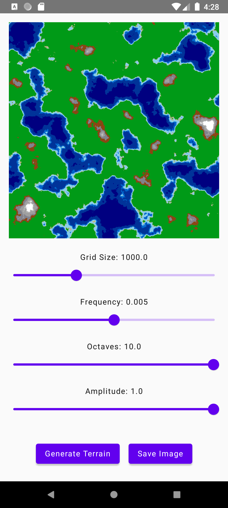
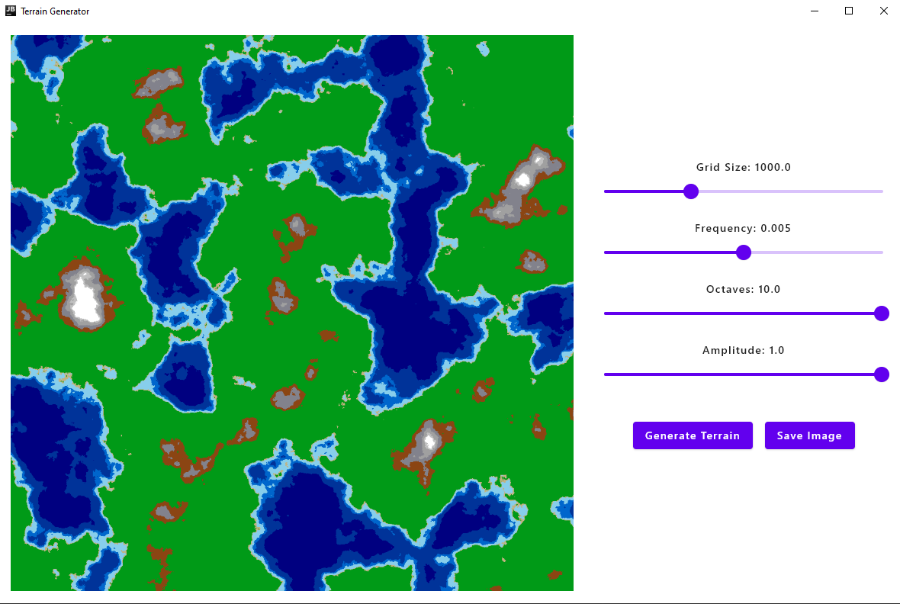

# Terrain Generation Demo

**A Kotlin Multiplatform project showcasing terrain generation using Perlin Noise and Fractal Brownian Motion algorithms.**

| Mobile View | Desktop View |
|---|---|
|  |  |
## Key Features

* **Interactive Parameter Adjustment:**  Manipulate grid size, amplitude, frequency, and octaves to see how they affect terrain formation.
* **Perlin Noise and Fractal Brownian Motion:**  Experience use of procedural algorithms in terrain generation.
* **Cross-Platform Compatibility:**  Run the demo on Android, Linux, Windows, and MacOS.
* **Image Export:**  Save the generated terrain as an image to your device.

## Technologies Used

* Kotlin Multiplatform
* Jetpack Compose
* Perlin Noise Algorithm
* Fractal Brownian Motion Algorithm

## Getting Started

**Prerequisites:**

* Android Studio (for Android development)
* JDK (for desktop development)

**Installation:**

1. Clone this repository: `git clone https://github.com/kotlinc0der/terrain-generator.git`
2. Open the project in Android Studio.
3. Build and run the project on your desired platform.

**Usage:**

1. Launch the application.
2. Use the sliders to adjust the parameters:
   * **Grid Size:** Controls the resolution of the terrain.
   * **Amplitude:** Affects the height variation of the terrain.
   * **Frequency:** Determines the level of detail in the terrain.
   * **Octaves:**  Adds layers of detail to the terrain using Fractal Brownian Motion.
3. Click the "Generate Terrain" button to create a new terrain based on the current parameters.
4. Click the "Save Image" button to export the generated terrain as an image.

## Future Enhancements

* **iOS Support:**  Extend the project to support iOS devices.
* **Additional Algorithms:**  Implement other terrain generation algorithms for greater variety.

## Contributing

Contributions are welcome! Feel free to open issues or submit pull requests.

## References
https://rtouti.github.io/graphics/perlin-noise-algorithm

